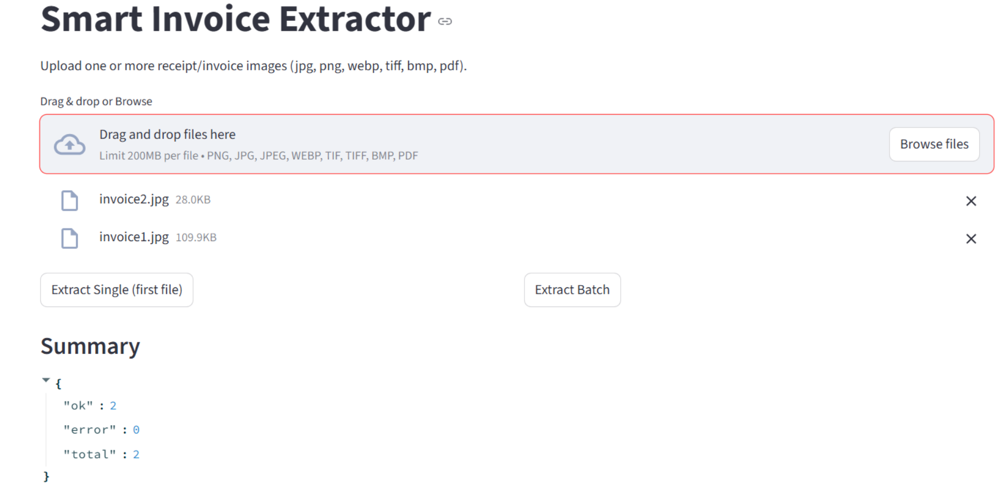
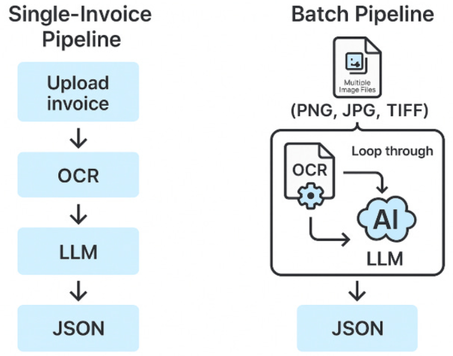
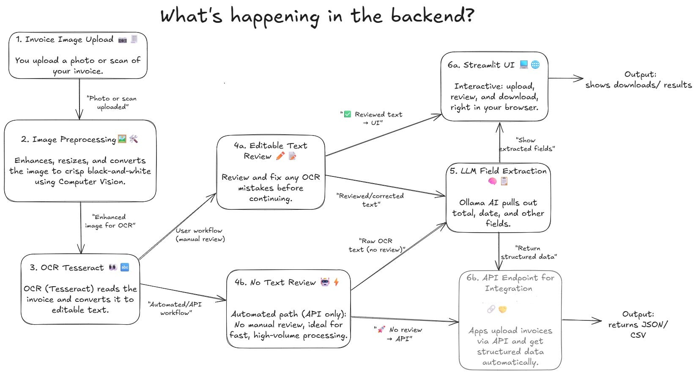

# 📑 Smart Doc Scanner (Invoice/Receipt Extractor)

An end-to-end **Smart Invoice Extractor** powered by **OCR (Tesseract)** and **local LLMs (Ollama)**.  
Process single or multiple images, extract key fields (invoice number, dates, totals, tax, etc.), and use it via a friendly **Streamlit UI**, a production-ready **FastAPI** backend, or a single **Docker** image that runs both.

---

## Why use this?

- **Save time:** Stop typing numbers from receipts/invoices.
- **Reduce errors:** OCR + LLM > manual entry.
- **Private & affordable:** Runs with **local** models via Ollama—no cloud keys or per-call fees.
- **Flexible:** UI for humans, API for apps, batch for accountants.
- **Portable:** Dockerized for “works everywhere” deployment.
---

## Who Is It For?

- **Accountants & operations teams** drowning in invoices  
- **Developers** who want a private, local extractor (no API costs)  
- **Students & data enthusiasts** looking to learn OCR + LLM integration  
- **Data teams** experimenting with OCR pipelines  

If you’ve ever thought *“I wish I didn’t have to type numbers from receipts again”* then this tool is for you.

---

## Features

- **Reads images & PDFs** (PNG, JPG/JPEG, WEBP, TIFF, BMP, PDF) using **Tesseract OCR**  
- **Extracts fields** with a **local LLM** (via [Ollama](https://ollama.com/)):
  - `invoice_number, invoice_date, due_date, subtotal, tax_rate, tax_amount, total, balance_due, cash, change, gst_id`
- **Single-file** or **multi-file (batch)** processing  
- **Two modes:**
  - **Streamlit** → drag & drop UI for humans  
  - **FastAPI** → machine API endpoints  
- **Dockerized** → runs anywhere with a single command  

---

## Screenshots & Diagrams

### 1. Streamlit Batch Processing
<p align="center">
  
</p>

### 2. Single vs Batch Invoice Pipeline
<p align="center">
  
</p>

### 3. Overall Architecture
<p align="center">
  
</p>

**Processing flow per invoice:**

1. Upload invoice (image/pdf)  
2. Preprocess (resize, binarize)  
3. OCR (Tesseract) → extract text  
4. Focus filter → keep invoice-relevant lines  
5. LLM (Ollama) → extract structured fields  
6. JSON output  

---

## Repo Structure

```
├── app_streamlit.py # Streamlit UI
├── fastapi_app.py # FastAPI backend
├── batch_ocr.py # Batch processing helpers
├── requirements.txt # Python dependencies
├── Dockerfile # Single container (Streamlit + FastAPI)
├── start.sh # Entrypoint script
├── samples/ # Example invoices
├── docs/ # Screenshots & diagrams
│ ├── single_vs_batch.png
│ ├── streamlit_batch_screenshot.png
│ └── architecture.png
```
---

## Setup

### Prerequisites
- **Python 3.11+** (if running locally)  
- **Tesseract OCR**  
  - Linux: `sudo apt-get install tesseract-ocr`  
  - Windows: [UB Mannheim builds](https://github.com/UB-Mannheim/tesseract/wiki)  
- **Ollama** (local LLM runtime) → [Install here](https://ollama.com/)  
  - Example models:
    ```bash
    ollama pull mistral:7b
    ollama pull gemma3:latest
    ```

---

## Usage

### A. Run Streamlit (UI only)

```bash
  pip install -r requirements.txt
  export OLLAMA_BASE="http://localhost:11434/v1"
  export LLM_MODEL="gemma3:latest"

  streamlit run app_streamlit.py
```
Open: http://localhost:8501

### B. Run FastAPI (API only)

```bash
pip install -r requirements.txt

# Point to your local Ollama server and model
export OLLAMA_BASE="http://localhost:11434/v1"
export LLM_MODEL="gemma:latest"

uvicorn fastapi_app:app --host 0.0.0.0 --port 8001 --reload
```
#### API Docs
Interactive API documentation will be available at:  
👉 http://127.0.0.1:8001/docs

---

#### Endpoints

##### Health Check
GET /health

##### OCR Only
POST /ocr

##### Extract (Single File)
POST /extract

##### Extract Batch (Multiple Files)
POST /extract-batch

---

#### Example Usage (cURL)

##### Single File
```bash
curl -X POST "http://127.0.0.1:8001/extract" \
  -F "file=@samples/invoice1.jpg"
```
##### Multiple Files
```bash
curl -X POST "http://127.0.0.1:8001/extract-batch" \
  -F "files=@samples/invoice1.jpg" \
  -F "files=@samples/invoice2.png"
```
### C. Docker (UI + API Together)

#### Build
```bash
docker build -t smart-doc-scanner .
```

### Run
```bash
docker run --rm -p 8001:8001 -p 8501:8501 \
  --add-host=host.docker.internal:host-gateway \
  -e OLLAMA_BASE=http://host.docker.internal:11434/v1 \
  -e LLM_MODEL=gemma3:latest \
  smart-doc-scanner
```

#### Access
- API Docs → http://127.0.0.1:8001/docs  
- UI → http://127.0.0.1:8501  

> **Note (Windows/macOS + Docker):**  
> Use `host.docker.internal` so the container can reach your host’s Ollama running at `http://localhost:11434`.

---

#### Example Output
```json
{
  "filename": "invoice1.jpg",
  "fields": {
    "invoice_number": "2022435",
    "invoice_date": "2022-07-19",
    "due_date": "2022-08-03",
    "subtotal": "2100.00",
    "tax_rate": "10%",
    "tax_amount": "210.00",
    "total": "2510.00",
    "balance_due": "NOT FOUND",
    "cash": "NOT FOUND",
    "change": "NOT FOUND",
    "gst_id": "NOT FOUND"
  },
  "model": "gemma3:latest"
}
```

## Troubleshooting

**“LLM read timeout / connect error”**  
- Make sure **Ollama** is running and the model is pulled.  
- Check `OLLAMA_BASE` (default `http://localhost:11434/v1`).  
- On Docker, use `http://host.docker.internal:11434/v1`.

**“OCR result is empty / poor text”**  
- Low-res or skewed scans harm OCR; try higher quality or better lighting.  
- Consider deskewing/denoising pre-processing if needed.

**Windows Tesseract path**  
- Set `TESSERACT_CMD` env var if Tesseract isn’t on PATH. Example:  
  ```bash
  TESSERACT_CMD="C:\Program Files\Tesseract-OCR\tesseract.exe"
  ```

  ## Known Limitations

- **Speed**: CPU-bound; batch can be slow. GPU acceleration is a future upgrade.  
- **OCR Quality**: Blurry/low-contrast images reduce accuracy.  
- **LLM Quirks**: May hallucinate fields; strict JSON schema helps contain it.  
- **Languages**: English by default; add Tesseract language packs for more.  

---

## Roadmap

- GPU acceleration (CUDA/DirectML) for faster extraction  
- Multi-language OCR (Spanish, German, Hindi, etc.)  
- Vision-Language models → skip OCR step entirely  
- Accounting integrations (Xero, QuickBooks, Notion)  
- Hosted/Public API for easy third-party integrations  

---

## Credits

- **OCR** → [Tesseract](https://github.com/tesseract-ocr/tesseract)  
- **LLM runtime** → [Ollama](https://ollama.com/)  
- **Backend** → [FastAPI](https://fastapi.tiangolo.com/)  
- **Frontend** → [Streamlit](https://streamlit.io/)  
- **Packaging** → [Docker](https://www.docker.com/) 
